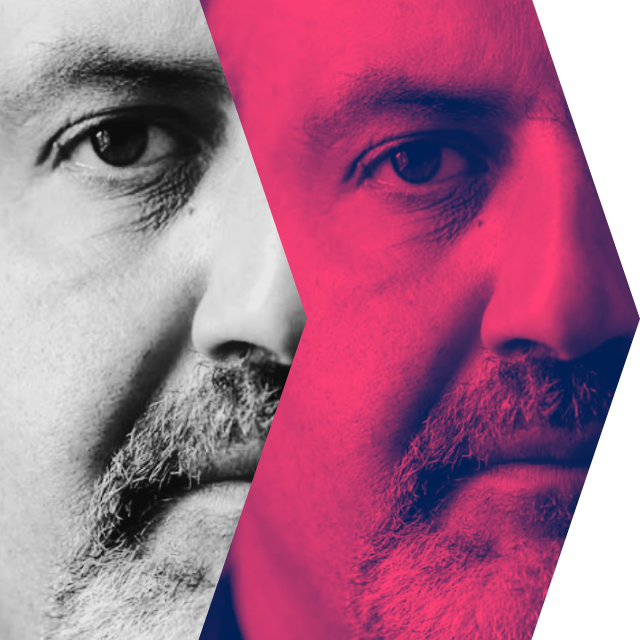

# Antifragile-Progress



**Less complexity. More momentum.**  
A lean framework to help you make steady progress on ideas, projects, and initiatives by avoiding overthinking and over-engineering.

---

## Why this exists
- Turn fuzzy ideas into **clear, lean moves**.  
- Escape traps of **future-problem-solving**.  
- Protect energy and **unlock momentum**.  
- Build progress that grows stronger under stress — *antifragile progress*.  

---

## Quick start
1. **Manual** - Read [`FRAMEWORK.md`](./FRAMEWORK.md) and run the Framework Checks against your idea, project or initiative.  
2. **AI** - Use [AntifragileProgressGPT](https://chatgpt.com/g/g-68cea04ba6a08191a8a6a64af139bd58-antifragileprogressgpt)

---

## Customizing your own CustomGPT

**Instructions (System Prompt):**  
Copy from [`customgpt/INSTRUCTIONS.md`](./customgpt/INSTRUCTIONS.md). This is the single source of truth for the prompt.

**Knowledge upload (files to upload in the CustomGPT UI):**  
1) Generate the knowledge files from the GPT-specific folder:  
   ```bash
   cd ai/openai/antifragile-progress-gpt/
   ./build-knowledge.sh -z
   ```
2) This will populate `ai/openai/antifragile-progress-gpt/knowledge-files/` with:
   - `FRAMEWORK.md` (copied from repo root; **upload this** to CustomGPT → Knowledge)
   - `MANIFEST.txt` (dev builds) or `MANIFEST-<version>.txt` (on releases; **informational only**)
   - `knowledge-upload-<...>.zip` (optional convenience bundle)

**Important paths:**  
- Scripts live in: `ai/openai/antifragile-progress-gpt/`  
- Output lives in: `ai/openai/antifragile-progress-gpt/knowledge-files/`  
- A placeholder `MANIFEST.md` is version-controlled in that folder so it isn’t empty; build outputs are gitignored.

**Conversation Starters & Description:**  
Provided in the [`customgpt/`](./customgpt/) folder (`STARTERS.md`, `DESCRIPTION.md`).

---

## License
MIT — free to use, adapt, and improve.
